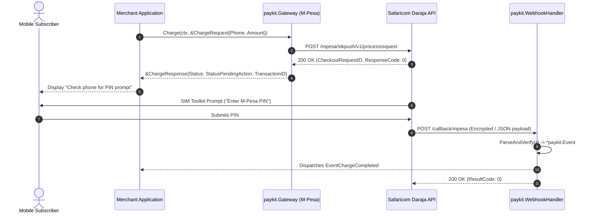

# ADR 0001: Capability-Based Interface Architecture for African Payment Rails

- **Status**: Accepted
- **Date**: 2026-09-22
- **Author**: Andrew Kihara (@carsonak)
- **Deciders**: PayKit-Go Maintainers & Community
- **Consulted**: @LawObare, @MargaretKerubo, @petraclara, @kamalogudah

---

## Context & Problem Statement

The initial prototype of `paykit-go` modeled its primary contract after conventional card processing gateways (such as Omnipay):
```go
// Legacy prototype interface
type Gateway interface {
    Purchase(ctx context.Context, req *PurchaseRequest) (*Response, error)
    Authorize(ctx context.Context, req *AuthorizeRequest) (*Response, error)
    Capture(ctx context.Context, req *CaptureRequest) (*Response, error)
    Void(ctx context.Context, req *VoidRequest) (*Response, error)
    Refund(ctx context.Context, req *RefundRequest) (*Response, error)
    QueryStatus(ctx context.Context, req *StatusRequest) (*Response, error)
    Name() string
}
```

While suitable for credit and debit card acquiring networks (which rely on two-phase authorization holds followed by settlement captures), this abstraction breaks down when integrating African payment infrastructure, particularly in Kenya and East Africa:

1. **Push & Callback vs. Two-Phase Holds**:
   Mobile money rails (Safaricom M-Pesa Daraja, Airtel Money) and regional aggregators (Pesapal, Splice Africa) do not support authorization holds or settlement voids. Instead, payments are initiated via asynchronous push requests (e.g., SIM Toolkit STK Push or USSD push prompts). The customer enters their PIN on their handset, and final settlement confirmation arrives out-of-band via an HTTP webhook/IPN callback.
2. **First-Class Disbursements (B2C Payouts)**:
   In Africa, business-to-customer (B2C) disbursements (payroll, vendor disbursements, gig economy payouts, loan issuances) are co-equal in volume and operational importance to customer collections. Card gateway abstractions treat disbursements as an afterthought or an atypical refund, whereas mobile money treats B2C as an independent transactional primitive with distinct authentication, limits, and settlement flows.
3. **Violation of the Interface Segregation Principle (ISP)**:
   Forcing every provider to implement `Authorize`, `Capture`, and `Void` forces mobile money drivers to return artificial `ErrUnsupportedOperation` errors, confusing SDK consumers and degrading type safety.
4. **Heterogeneous Provider Webhooks**:
   Different providers format asynchronous payment receipts differently (e.g., M-Pesa uses deeply nested key-value metadata arrays; Airtel uses flat JSON; Pesapal uses URL-encoded query notifications). The SDK lacked a structured, type-safe webhook ingestion and verification standard.

A foundational architectural redesign is required to support African payment rails natively while remaining extensible to international card processors and aggregators.

---

## Decision Drivers

- **Idiomatic Go Design**: Leverage Go's implicit interface satisfaction and small, single-purpose interfaces (mirroring the standard library's `io.Reader`, `io.Writer`, and `io.Closer`).
- **Domain Accuracy**: Reflect real-world African payment primitives (`Charge`, `Disburse`, `WebhookHandler`, `BalanceChecker`) without artificial card-processing metaphors.
- **Consumer Ergonomics**: Provide both direct type-safe constructors (`mpesa.New(...)`) for 95% of direct integrations, alongside a dynamic registry (`paykit.Get(...)`) for multi-tenant or multi-rail applications.
- **Extensibility & Backward Compatibility**: Allow future capabilities (such as direct card processing or recurring subscriptions) to be added as discrete capability interfaces without breaking existing mobile money implementations.

---

## Considered Alternatives

### 1. Monolithic Card Gateway (Omnipay Model)
Maintain a single unified `Gateway` interface containing `Purchase`, `Authorize`, `Capture`, `Void`, `Refund`, and `Payout`.

- *Pros*: Single interface type throughout the application.
- *Cons*: Violates Interface Segregation Principle (ISP). Mobile money adapters must implement dummy methods returning runtime errors (`ErrMethodNotSupported`). Callers cannot determine at compile time whether a provider actually supports two-phase authorization or disbursements.

### 2. Hierarchical Resource Services (Stripe-Go Model)
Expose a single massive client struct with nested service objects (e.g., `client.Charges.New(...)`, `client.Payouts.New(...)`, `client.Customers.New(...)`).

- *Pros*: Familiar to developers accustomed to Stripe.
- *Cons*: Tightly couples the consumer to a single monolithic API surface. In Go, mocking nested service structs requires extensive interface wrappers or deep test doubles. Furthermore, differing payment rails do not share Stripe's unified relational resource model.

### 3. Plugin Architecture with Dynamic Loading (KillBill Model)
Implement OSGi-style runtime plugins loaded as shared objects (`.so`) or RPC subprocesses.

- *Pros*: Isolated provider deployment lifecycles.
- *Cons*: Go's plugin package has severe platform limitations (Cgo requirements, strict build tag and dependency matching). Subprocess RPC adds immense latency and operational complexity inappropriate for an embedded payment SDK.

### 4. Segregated Capability Interfaces (Selected)
Define small, composable capability interfaces matching distinct payment operations. Providers implement only the capabilities they physically support.

- *Pros*: Highly idiomatic Go. Zero runtime overhead. Strict compile-time validation. Clean mockability. Complete decoupling between collection, payout, and webhook handling.
- *Cons*: Callers consuming generic `paykit.Gateway` instances must use Go type assertions to detect optional capabilities (e.g. disbursements).

---

## Decision Outcome

We adopt **Segregated Capability Interfaces** combined with a **Dual-Mode Import Strategy**.

### 1. Capability Interfaces

All payment operations are partitioned into focused, single-purpose interfaces defined in the root `paykit` package:

```go
package paykit

import (
    "context"
    "net/http"
)

// Gateway is the primary collection interface implemented by providers that
// support customer charges, refunds, and transaction status queries.
type Gateway interface {
    // Name returns the canonical provider identifier (e.g., "mpesa", "airtel", "pesapal").
    Name() string

    // Charge initiates a customer payment collection (e.g., STK Push, USSD push, or hosted checkout).
    Charge(ctx context.Context, req *ChargeRequest) (*ChargeResponse, error)

    // QueryStatus queries the current status of an initiated transaction.
    QueryStatus(ctx context.Context, req *StatusRequest) (*StatusResponse, error)

    // Refund initiates a full or partial refund/reversal of a completed charge.
    Refund(ctx context.Context, req *RefundRequest) (*RefundResponse, error)
}

// Disburser is implemented by payment providers supporting B2C payouts.
type Disburser interface {
    // Disburse transfers funds from the business account to a recipient (e.g. B2C mobile payout).
    Disburse(ctx context.Context, req *DisbursementRequest) (*DisbursementResponse, error)
}

// WebhookHandler is implemented by providers that receive and process asynchronous callbacks.
type WebhookHandler interface {
    // ParseAndVerify validates request authenticity (signatures, tokens) and unpacks the payload into an Event.
    ParseAndVerify(r *http.Request) (*Event, error)
}

// BalanceChecker is implemented by providers that expose account balance inquiries.
type BalanceChecker interface {
    // CheckBalance retrieves current ledger and available balances from the provider.
    CheckBalance(ctx context.Context, req *BalanceRequest) (*BalanceResponse, error)
}
```

### 2. Runtime Capability Querying

When consuming a generic gateway instance, callers inspect capabilities using standard Go type assertions:

```go
func ExecutePayout(ctx context.Context, gw paykit.Gateway, req *paykit.DisbursementRequest) (*paykit.DisbursementResponse, error) {
    disburser, ok := gw.(paykit.Disburser)
    if !ok {
        return nil, fmt.Errorf("provider %q does not support disbursements: %w", gw.Name(), paykit.ErrCapabilityUnsupported)
    }
    return disburser.Disburse(ctx, req)
}
```

Compile-time verification in provider packages guarantees interface conformance:
```go
var (
    _ paykit.Gateway        = (*MpesaGateway)(nil)
    _ paykit.Disburser      = (*MpesaGateway)(nil)
    _ paykit.WebhookHandler = (*MpesaGateway)(nil)
)
```

### 3. Dual-Mode Import Architecture

1. **Mode A: Direct Type-Safe Constructors (Primary / Recommended)**:
   Consumers import the specific provider package directly for compile-time safety and self-documenting configuration:
   ```go
   import "github.com/Flying-Tea-Squad/paykit-go/mpesa"

   gw, err := mpesa.New(mpesa.Config{
       ConsumerKey:    os.Getenv("MPESA_KEY"),
       ConsumerSecret: os.Getenv("MPESA_SECRET"),
       Passkey:        os.Getenv("MPESA_PASSKEY"),
       ShortCode:      "174379",
   })
   ```

2. **Mode B: Dynamic Gateway Registry (Multi-Provider / Dynamic Routing)**:
   For applications routing dynamically between providers based on database configurations or MSISDN telco prefixes:
   ```go
   import (
       "github.com/Flying-Tea-Squad/paykit-go"
       _ "github.com/Flying-Tea-Squad/paykit-go/mpesa"
       _ "github.com/Flying-Tea-Squad/paykit-go/airtel"
   )

   gw, err := paykit.Get("mpesa", cfg)
   ```

---

## Architectural Interaction Diagram



---

## Consequences

### Positive
- **Accurate Domain Modeling**: Cleanly expresses the realities of African mobile money, STK push collections, and B2C disbursement pipelines.
- **Interface Segregation**: Providers only implement capabilities they support; no dummy methods returning errors.
- **Extensibility**: New payment rails (e.g. card acquiring, bank transfers, crypto rails) can introduce new capabilities without altering existing interfaces.
- **Superior Testability**: Applications can mock just `paykit.Gateway` for charging, or mock `paykit.Disburser` for payroll testing without mocking unneeded methods.

### Negative & Mitigations
- **Breaking Change**: Existing prototype callers referencing `Purchase`, `Authorize`, or `Capture` must migrate to `Charge`. Legacy request types are deprecated gracefully.
- **Type Assertion Boilerplate**: Interacting with optional capabilities requires `gw.(paykit.Disburser)` assertions. This is mitigated by providing helper functions in the upcoming `paykit.Client` high-level facade.

---

## References

- Safaricom Daraja 2.0 API Specification: [developer.safaricom.co.ke](https://developer.safaricom.co.ke)
- Airtel Money Africa Developer Portal: [developers.airtel.africa](https://developers.airtel.africa)
- Pesapal v3 API Documentation: [developer.pesapal.com](https://developer.pesapal.com)
- Go Standard Library Interface Composition (`io.Reader`, `io.Writer`)
